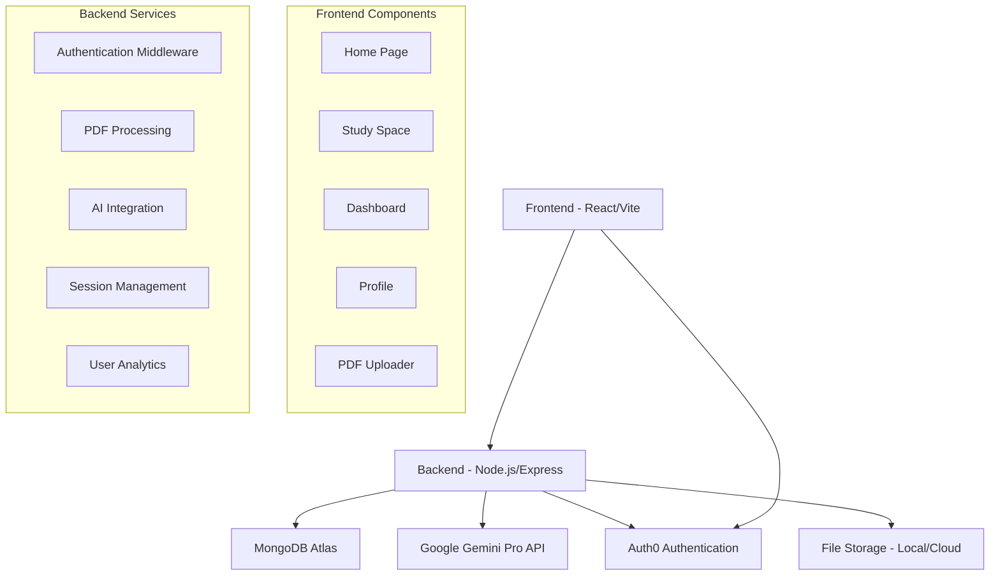

# 🧠 ZenGenius - Design Document & Architecture

## 📋 Project Overview

**ZenGenius** is an AI-powered study assistant that transforms PDF documents into interactive learning materials using Google Gemini Pro. The application focuses on enhancing student productivity through intelligent summarization, flashcard generation, and study session tracking.

## 🎯 Core Vision

Create a comprehensive learning ecosystem that:

- Reduces study preparation time by 80%
- Improves retention through AI-generated flashcards
- Tracks learning patterns and focus levels
- Provides personalized study insights

## 🏗️ System Architecture



## 🔧 Technical Stack

### Frontend

- **Framework**: React 18 + Vite
- **UI Library**: Chakra UI v2
- **State Management**: React Hooks + Context
- **Authentication**: Auth0 React SDK
- **HTTP Client**: Axios
- **Routing**: React Router v6

### Backend

- **Runtime**: Node.js (ES Modules)
- **Framework**: Express.js v5
- **Database**: MongoDB with Mongoose ODM
- **Authentication**: Auth0 + JWT
- **AI Integration**: Google Gemini Pro API
- **File Processing**: Multer + pdf-parse

### Infrastructure

- **Database**: MongoDB Atlas (Cloud)
- **Authentication**: Auth0 (SaaS)
- **AI Service**: Google AI Studio
- **Version Control**: Git + GitHub

## 📊 Data Models

### User Session Schema

```javascript
{
  userId: String (Auth0 ID),
  mood: String (Tired/Okay/Good/Energized),
  focus: Number (0-10 scale),
  summary: String (AI-generated),
  flashcards: String (Q&A format),
  fileName: String,
  date: Date (auto-generated)
}
```

### Focus Tracking System

```javascript
{
  sessionId: ObjectId,
  focusLevel: Number (0-10),
  timestamp: Date,
  studyDuration: Number (minutes),
  breaksTaken: Number,
  productivity: Number (calculated)
}
```

## 🎨 User Experience Design

### Design Principles

1. **Simplicity First** - Minimal cognitive load
2. **Focus-Driven** - Distraction-free interface
3. **Progress Visible** - Clear feedback loops
4. **Accessibility** - WCAG 2.1 compliant
5. **Mobile-First** - Responsive design

### Color Palette

- **Primary**: Teal (#319795) - Focus and clarity
- **Secondary**: Gray (#718096) - Supporting elements
- **Success**: Green (#38A169) - Positive feedback
- **Warning**: Orange (#DD6B20) - Attention needed
- **Error**: Red (#E53E3E) - Error states

### Typography

- **Headings**: Inter (Bold)
- **Body**: Inter (Regular)
- **Code**: Fira Code (Monospace)

## 🔄 User Flow

### Primary Study Flow

1. **Authentication** → Auth0 login
2. **Mood Check** → Select current mood
3. **Focus Assessment** → Rate focus level (0-10)
4. **PDF Upload** → Drag & drop interface
5. **AI Processing** → Gemini summarization
6. **Study Materials** → Summary + flashcards
7. **Session Save** → Store progress

### Secondary Flows

- **Dashboard Review** → Past sessions
- **Profile Analytics** → Study patterns
- **Settings** → Preferences

## 🚀 Performance Requirements

### Response Times

- **PDF Upload**: < 2 seconds
- **AI Processing**: < 10 seconds
- **Page Load**: < 1 second
- **Authentication**: < 3 seconds

### Scalability

- **Concurrent Users**: 100+
- **File Size Limit**: 10MB per PDF
- **Storage**: 1GB per user
- **API Rate Limits**: Gemini Pro limits

## 🔒 Security Considerations

### Authentication & Authorization

- **OAuth 2.0** via Auth0
- **JWT tokens** for API access
- **Role-based access** (future)
- **Session management**

### Data Protection

- **Environment variables** for secrets
- **HTTPS only** in production
- **Input validation** on all endpoints
- **File type restrictions**

### Privacy

- **GDPR compliance** ready
- **Data retention policies**
- **User consent management**
- **Anonymization options**

## 📱 Responsive Design

### Breakpoints

- **Mobile**: 320px - 768px
- **Tablet**: 768px - 1024px
- **Desktop**: 1024px+

### Mobile Optimizations

- Touch-friendly buttons (44px minimum)
- Simplified navigation
- Optimized file upload
- Swipe gestures for flashcards

## 🧪 Testing Strategy

### Unit Testing

- **Frontend**: Vitest + React Testing Library
- **Backend**: Jest + Supertest
- **Coverage Target**: 80%+

### Integration Testing

- **API endpoints** testing
- **Database operations**
- **Authentication flows**
- **File upload/processing**

### E2E Testing

- **Playwright** for critical paths
- **User journey testing**
- **Cross-browser compatibility**

## 🚀 Deployment Architecture

### Development

- **Frontend**: Vite dev server (localhost:5173)
- **Backend**: Nodemon (localhost:5000)
- **Database**: MongoDB Atlas (shared)

### Production (Planned)

- **Frontend**: Vercel/Netlify
- **Backend**: Railway/Render
- **Database**: MongoDB Atlas (dedicated)
- **CDN**: Cloudflare (assets)

## 📈 Analytics & Monitoring

### User Analytics

- **Study session duration**
- **Focus level trends**
- **PDF processing success rate**
- **Feature usage patterns**

### Technical Monitoring

- **API response times**
- **Error rates**
- **Database performance**
- **AI API usage/costs**

## 🔮 Future Enhancements

### Phase 2 Features

- **Spaced repetition** algorithm
- **Multiple AI models** (GPT-4, Claude)
- **Export functionality** (Anki, PDF)
- **Collaborative study** rooms

### Phase 3 Features

- **Mobile app** (React Native)
- **Voice interactions**
- **Advanced analytics**
- **Gamification** elements

## 🎯 Success Metrics

### User Engagement

- **Daily Active Users** (DAU)
- **Session Duration** (avg 15+ minutes)
- **Return Rate** (70%+ weekly)
- **Feature Adoption** (80%+ use flashcards)

### Learning Outcomes

- **Study Time Reduction** (target: 50%)
- **Retention Improvement** (measured via quizzes)
- **User Satisfaction** (NPS > 50)
- **Academic Performance** (self-reported)

---

_This design document serves as the foundation for ZenGenius development and should be updated as the product evolves._
